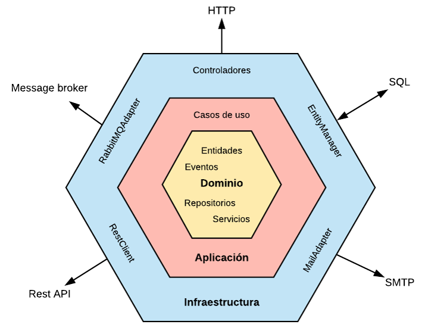

# Proyecto de Ejemplo con Quarkus y Arquitectura Hexagonal

Este es un proyecto de ejemplo que demuestra la implementación de la arquitectura hexagonal (puertos y adaptadores) utilizando Quarkus y Java. La arquitectura hexagonal busca separar las preocupaciones, permitiendo que el núcleo de la aplicación (dominio) permanezca independiente de la infraestructura y las interfaces externas.

## ¿Qué es la Arquitectura Hexagonal?

La arquitectura hexagonal, también conocida como Ports and Adapters, organiza la aplicación en un núcleo central que contiene la lógica de negocio (dominio). Este núcleo se conecta a través de "puertos" que definen las interfaces para interactuar con el exterior, como bases de datos, APIs, UI, etc. Los "adaptadores" implementan esos puertos, permitiendo la comunicación con diferentes tecnologías o interfaces sin afectar el dominio.



## Estructura del Proyecto

- `src/main/java/com/resolutions/adapters`: Código fuente adaptadores: In (Controladores), out (Bridges y Repositorios).
- `src/main/java/com/resolutions/applications`: Código fuente del núcleo: Casos de usuos y puertos.
- `src/main/java/com/resolutions/modelo`: Código fuente del núcleo: Entidades.
- `src/main/resources/`: Configuración.
- `test/`: Pruebas unitarias y de integración.

## Características principales

- Implementación en Quarkus para un arranque rápido y eficiente.
- Separación clara entre lógica de negocio y adaptadores tecnológicos.
- Fácil de extender con nuevos adaptadores o puertos.

## Cómo ejecutar

1. Clonar el repositorio:
```bash
git clone https://github.com/ronaldsanchez/hexagonal-arquitecture.git
```
2. Correr una imagen de oracle. Ejecute los comandos de Podman ubicados en el archivo: `podman/Oracle24ai_FREE.txt`
<br>   

3. Correr el aplicativo:
```bash
./mvnw quarkus:dev
```

4. Tester el aplicativo:
```bash
curl -d '{"catDesc":"Menu Principal","codUsr":"rsanchez"}' -H "Content-Type: application/json" POST http://localhost:8080/api/catalogos -w "\n" -v
```